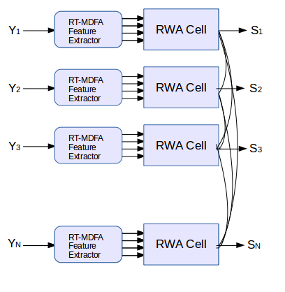

# MDFA-DeepLearning
MDFA-DeepLearning is a library for building machine learning applications on large numbers of multivariate time series (or sequential) data, with a heavy emphasis on noisy (non)stationary data.
The goal of MDFA-DeepLearning is to learn underlying patterns, signals, and regimes in 
multivariate time series and to detect and predict or forecast them in real-time with the
aid of both the multivariate direct filter approach (MDFA) and deep recurrent neural networks. 
In this package, we focus on two network structures, namely a recurrent weighted average network
and a standard long-short term memory network. 



## Why Use MDFA-DeepLearning
One might want to develop predictive models in multivariate time series data 
using MDFA-DeepLearning if the time series exhibit any of the following properties:
1) High-Dimensionality (many (un)correlated nonstationary time series)
2) Difficult to forecast using traditional model-based methods (VARIMA/GARCH) or traditional
deep learning methods (RNN/LSTM, component decompositions, etc)   
3) Emphasis needed on out-of-sample real-time signal extraction and forecasting
4) Regime changing in the underlying dynamics (or data generating process) of the time series is a common occurrence 

The MDFA-DeepLearning approach differs from most machine learning methods in time series analysis in that an emphasis on real-time feature extraction is utilized where the features extractors are build using the multivariate direct filter approach. The motivation behind this coupling of MDFA with machine learning is that, while many time series decomposition methodologies exist (from empirical mode decomposition to stochastic component analysis methods), all of these rely on either in-sample decompositions on historical data (useless for future data), and/or assumptions about the boundary values, neither of which are attractive when fast, real-time out-of-sample predictions are the emphasis.  

Furthermore, simply applying standard recurrent neural networks for step-ahead forecasting or 
signal extraction directly on the noisy data is a useless exercise - the recurrent networks will only learn noise, producing signals and forecasts of little to no value. 

## Requirements

MDFA-DeepLearning requires both the MDFA-Toolkit package for constructing the time series feature extractors and the Deeplearning4j (dl4j) library for the deep recurrent neural network constructors. The dl4j library is freely available at github.com/deeplearning4j, but is included in the build of this package using Gradle as the dependency management tool. 

The back-end for the dl4j package will depend on your computational infrastructure, but is available 
on a local basis using CPUs, or can take advantage of GPUs using CUDA libraries. In this package I have included a reference to both (assuming a standard linux64 architecture. 

The back-end used for the novel feature extraction technique is the MDFA-Toolkit which is 
available on the github, which will run on the ND4J package.  

## Installation

For the build and package management, we use a Gradle wrapper, and either Eclipse, IntelliJ, or NetBeans are recommended for the IDEs. Once the package has been cloned, the easiest way to get the package installed and running is by using an Import -> Gradle -> Gradle Project in your IDE. Once successfully loaded, Gradle will automatically fetch all the dependencies including 
the dl4j src libraries. By default, I have set the backend ND4J package to `nd4j-native-platform`, but if 
GPU computation is desired, this can be set to `nd4j-cuda-x-platform` where `x` is your CUDA library version
installation. 
   
Examples of how to setup and use this package are found in the examples folder under the src directory, and more detailed versions will be continuously added on the author's main blog www.imetricablog.com. 

```

/* Create a collection of .csv market data files */
String[] dataFiles = new String[]{"AAPL.daily.csv", "GOOG.daily.csv", "QQQ.daily.csv"};

/* Create a market feed out of the data files where Index is name of DateTime stamp index and 
   Open is the market value at that DateTime stamp */
   CsvFeed marketFeed = new CsvFeed(dataFiles, "Index", "Open");
/* Create some MDFA sigEx processes */
	
		MDFABase[] anyMDFAs = new MDFABase[3];
		
		anyMDFAs[0] = (new MDFABase()).setLowpassCutoff(Math.PI/20.0)
				.setI1(1)
				.setHybridForecast(.01)
				.setSmooth(.3)
				.setDecayStart(.1)
				.setDecayStrength(.2)
				.setLag(-2.0)
				.setLambda(2.0)
				.setAlpha(2.0)
				.setSeriesLength(400);
		
		anyMDFAs[1] = (new MDFABase()).setLowpassCutoff(Math.PI/10.0)
				.setBandPassCutoff(Math.PI/15.0)
				.setSmooth(.1)
				.setSeriesLength(400);
		
		anyMDFAs[2] = (new MDFABase()).setLowpassCutoff(Math.PI/5.0)
                .setBandPassCutoff(Math.PI/10.0)
                .setSmooth(.1)
                .setSeriesLength(400);

```
